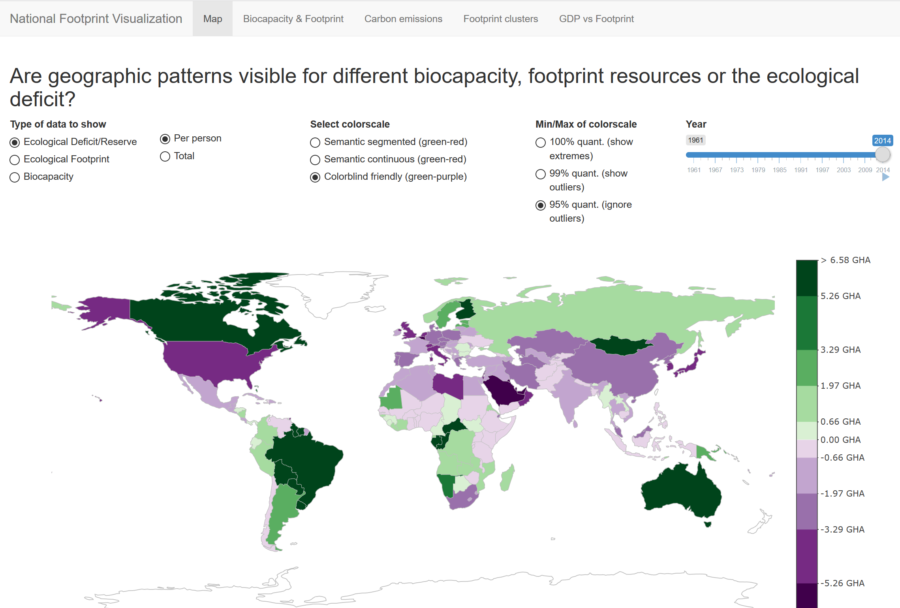

# National Footprint Visualization

Live version available at: https://luksurious.shinyapps.io/national-footprint/ (June 2019)

## Prerequisites
The following R packages need to be installed in order to run this Shiny app:

* shiny
* plotly > 4.9.0
* dplyr
* ggplot2
* tidyverse

## Set up
1. Download the dataset from https://www.kaggle.com/footprintnetwork/national-footprint-accounts-2018
2. Put the CSV file into the `data` folder, so it is available at `data/NFA 2018.csv`
3. Run the Shiny app

## Notes
- On some systems the maps visualization don't work in the built-in browser of RStudio. Make sure to open the Shiny App in your standard browser.